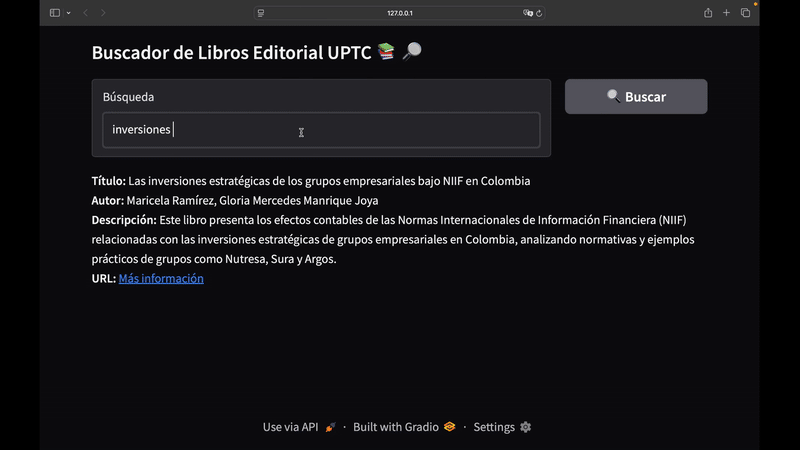
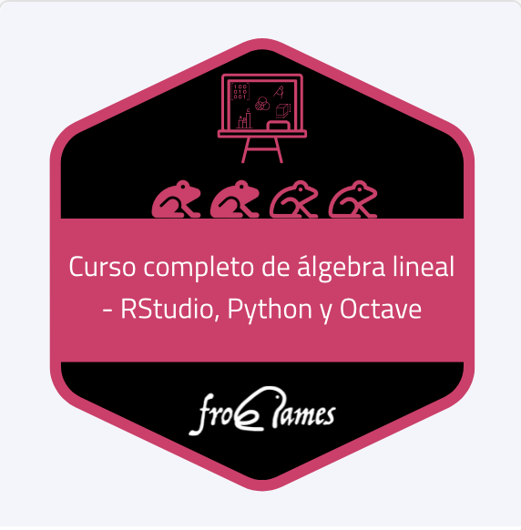
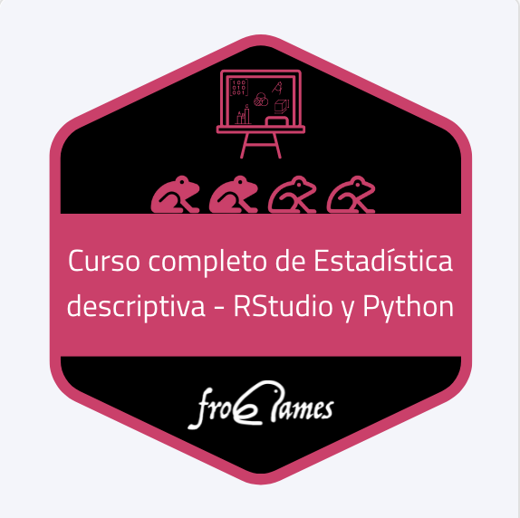
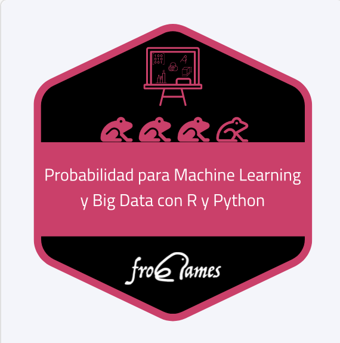
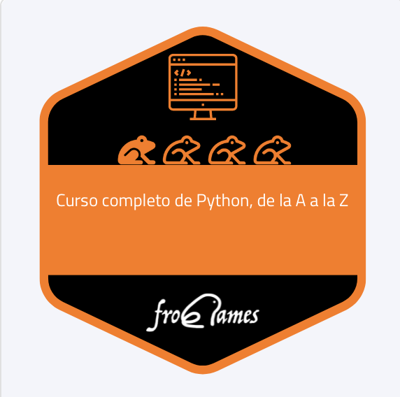
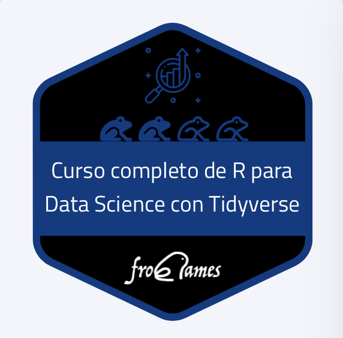
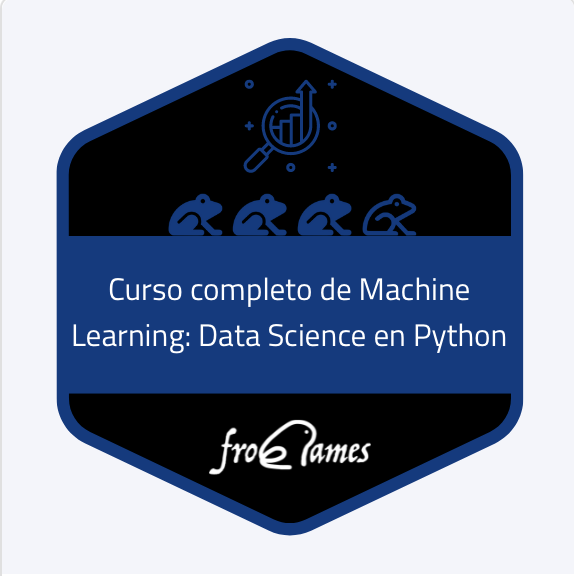
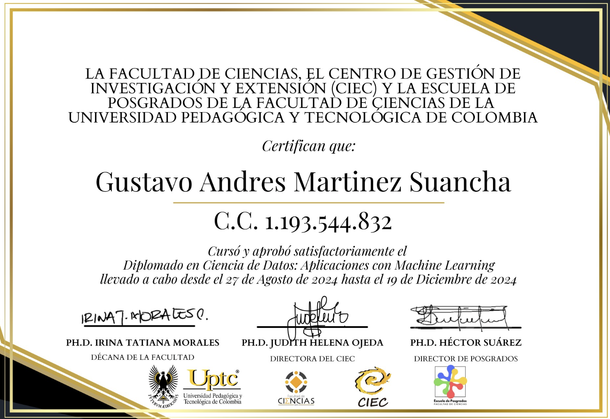

# 👋 Hola, soy Gustavo Martinez

## Científico de Datos & Matemático
Convierto datos complejos en decisiones de negocio claras a través de modelos de machine learning y visualizaciones interactivas. Mi experiencia se centra en descubrir patrones ocultos para resolver problemas estratégicos y busco un rol donde pueda aplicar estas habilidades en un equipo innovador.

---

## 🚀 Proyectos Destacados

- ### Rendimiento Académico - Análisis y Predicción

Analicé un conjunto de datos de estudiantes para descubrir los factores que más influyen en el rendimiento académico. Utilicé técnicas de análisis exploratorio y modelos de machine learning para predecir el desempeño de los estudiantes a partir de variables demográficas, identificando patrones clave que pueden ayudar a mejorar la toma de decisiones educativas.

**Tecnologías:** Python, Pandas, Scikit-learn, Matplotlib, Kaggle

[🔗 Ver notebook completo en Kaggle](https://www.kaggle.com/code/andresmartinez21/rendimiento-acad-mico/notebook)

- ### Sistema de Recomendación de Películas para Netflix

Desarrollé un sistema de recomendación que sugiere películas similares a partir de las características de cada título, como la descripción, actores y género. Cuando el usuario selecciona una película, el modelo analiza sus atributos y le sugiere automáticamente cuatro películas relacionadas, mejorando la experiencia de descubrimiento en la plataforma.

**Tecnologías:** R, tidyverse, knitr, magrittr, tm, lsa, Kaggle

[🔗 Ver notebook completo en Kaggle](https://www.kaggle.com/code/andresmartinez21/netflix-recommendation-system)

- ### Scraper y Buscador de Bases de Datos - Editorial UPTC

Desarrollé una herramienta que automatiza la recolección de datos de la Editorial UPTC mediante técnicas de web scraping. El sistema extrae información relevante de libros y publicaciones, almacena los datos en una base de datos no estructurada (MongoDB) y permite a los usuarios buscar y filtrar resultados a través de una interfaz sencilla. Este proyecto facilita el acceso a información académica y bibliográfica para estudiantes e investigadores.

**Tecnologías:** Python, BeautifulSoup, MongoDB, Gradio, LangChain

[🔗 Ver repositorio en GitHub](https://github.com/gustavo21math/Editorial_Uptc/tree/main)

## 🛠️ Habilidades

- **Lenguajes:** Python, R, SQL, MongoDB
- **Machine Learning:** Scikit-learn, Feature-engine, TensorFlow
- **Visualización:** Matplotlib, Seaborn, Plotly, Tableau
- **Herramientas:** Conda, Git, GitHub, Docker

---

## 🎓 Formación y Certificaciones

| Certificado | Descripción |
|-------------|-------------|
|  | Curso completo de álgebra lineal - RStudio, Python y Octave   Frogames, Jul 2024 |
|  | Curso completo de Estadística descriptiva - RStudio y Python   Frogames |
|  | Probabilidad para Machine Learning y Big Data con R y Python   Frogames, Jun 2024 |
|  | Curso completo de Python, de la A a la Z   Frogames |
|  | Curso completo de R para Data Science con Tidyverse   Frogames, Ago 2024 |
|  | Curso completo de Machine Learning: Data Science en Python   Frogames, Nov 2024 |
|  | Diplomado en Ciencia de Datos   CIEC, 2024 |

---

## 📫 Contacto

- Email: successtotal21@gmail.com
- [LinkedIn](www.linkedin.com/in/gustavo-martinez-suancha-55b668312)
- [GitHub](https://github.com/gustavo21math)
- [Kaggle](https://www.kaggle.com/andresmartinez21)
- [Hugging-Face](https://huggingface.co/Andres-21)

